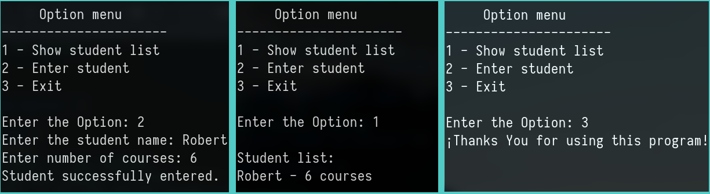
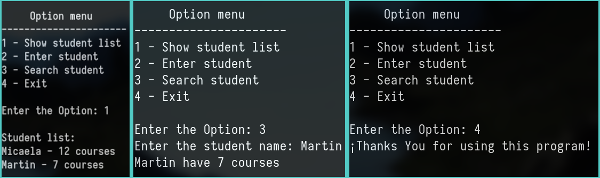
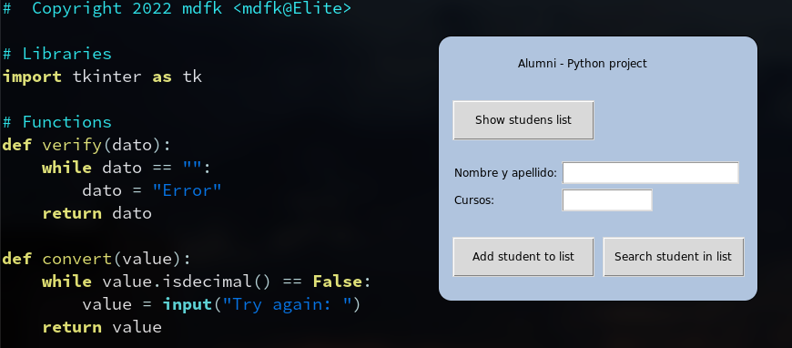

# Forms CLI > GUI
Project to development CLI application to GUI in Python with TKinter

## Step 1
Program to count courses per students
  - CLI application
  - Enter student and courses in list
  - Option menu
  - Option loop until "exit" option
  

## Step 2
Modification DB & add 3rd option.
  - List to dictionary
    - key: student name
    - value: courses number
  - 3rd option to single search

## Step 3
Migrate project to Desktop GUI environment write in Tkinter
  - Show student list in terminal
  - Other option in GUI

